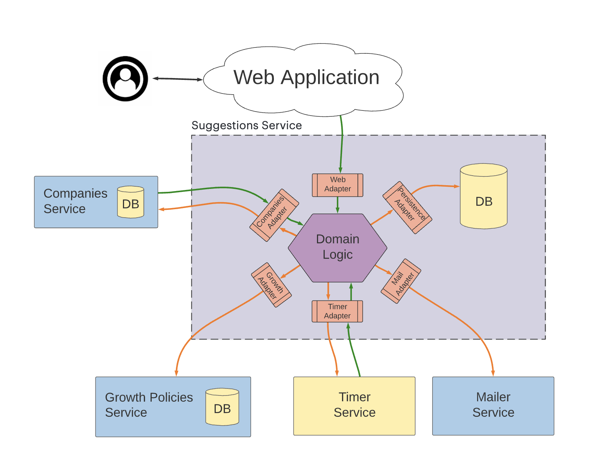

# Reveal Developer Test


## Objectives

This test aims at getting an idea about how candidates fit Reveal's standards in terms of backend software development.

With this test we will evaluate your **modeling**, **coding** and **testing** skills.


## General instructions

We expect you to spend 2 to 3 hours on the exercise.
If you could not complete it or if you could not spend that much time on it, 
feel free to send us back what you had time to do. In any case you can join to your code
an explanation of what you did, what is missing, what you would like to improve ...
Plus we would rather see an incomplete tested code than a complete untested code ... ;)

### Programming Language

In this repository, you will find some Python files that aim to help understanding the exercise.
Feel free to use **any other programming language** you feel more comfortable with.


### Deliver your results

Once you have finished working on the test, you can either create a fork of that repo 
or zip the code and send it to us by mail.


## Building a Partnership Suggestion service for Reveal Companies


To leverage Reveal platform, Companies need to be connected with Partners.
In this exercise you will build a service to suggest new partners to existing companies.
For any new company, we will retrieve the list of companies we could suggest as partners.
Once computed, we will store those suggested partners in a database and schedule a sequence of emails 
to notify users that we found potential partners for them.
Users can accept or decline those suggestions and from the moment they performed one of these actions we should stop
sending them emails mentioning the suggestion.

To implement that we will follow the **[Ports & Adapters Architecture](https://medium.com/idealo-tech-blog/hexagonal-ports-adapters-architecture-e3617bcf00a0)**
You will build the **domain logic** of of the Suggestions Service.
For that, you need also to define interfaces between the adapters & the domain logic.
But you must not implement any adapters.

On the following schema the Domain Logic is represented with an Hexagon.
Adapters 



The workflow to implement is the following:
1. When a new company joins Reveal, the **Companies Service** notifies the **Suggestions Service** that it happened. 
2. The Suggestion Service must then decide which partnerships to suggest to the new company.
To do so, the Suggestion Service asks the **Companies Service** (through the **Companies Adapter**) for companies with same `country` and `industry`.
3. The computed suggestions are stored in the database using the **Persistence Adapter**
4. Any time a batch of suggestions is created the **Suggestions Service** then asks the **Growth Policies Service** the sequence of emails to be sent.
The response from the service is a list of tuples like :
```
[
    #  (email_type, time_to_wait_before_sending_the_email_in_seconds) 
    (1, 3600),
    (2, 86400),
    (4, 604800),
]
```
5. The **Suggestions Service** then ask the **Timer Service** to set a timer to be notified when the first email of the sequence
has to be sent (in the above example 3600).
6. When the first breakpoint is reached the **Timer Service** notifies the **Suggestion Service**.
If some suggested partners are still not accepted nor declined, the **Suggestion Service** asks the **Growth Policies Service**
for the title, content and recipients of the email to be sent. Those values depend on three parameters:
- The primary key of the company we want to notify
- The email type
- The list of suggested partners that are not accepted or declined. 
7. The **Mailer Service** can then be called to send the notification email to recipients.
8. Once the first email is sent the next emails can be scheduled and sent applying the same process 
(Timer -> Growth Policies -> Mailer).
9. At any given point in time after the suggestion was made, a user might accept or decline it in the **Web Application**,
which notifies the **Suggestions Service**, that persists this action.


You are tasked to implement the **Domain Logic** of the **Suggestions Service**.

The **Inbound Adapters** (which flow is represented by the green arrows on the schema), will be represented by the public interfaces of the Domain Logic.
An example is given in [`suggestion_service/suggestions.py`](./suggestion_service/suggestions.py)

The **Outbound Adapters** (which flow is represented by the orange arrows on the schema), should be classes/methods/interfaces which exist but their body is empty. In Python, they would only contain `raise NotImplemented`
An example is given in [`suggestion_service/adapters/mailer_adapter.py`](./suggestion_service/adapters/mailer_adapter.py)

